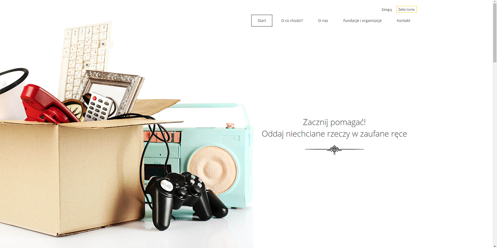
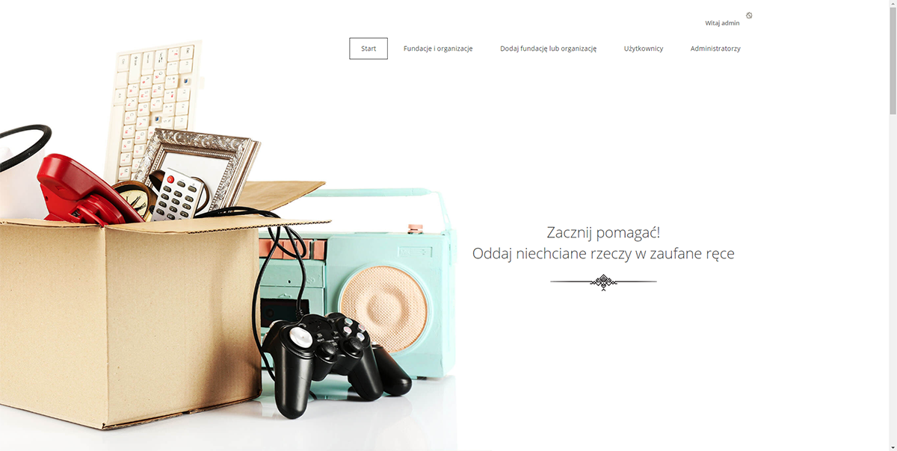
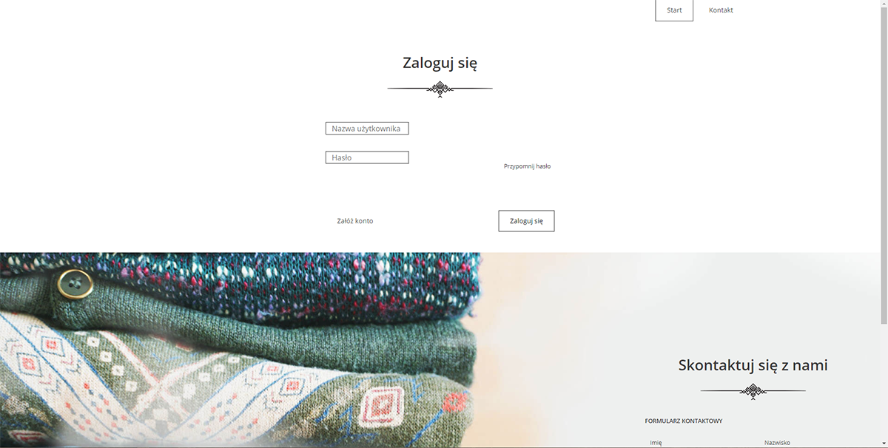
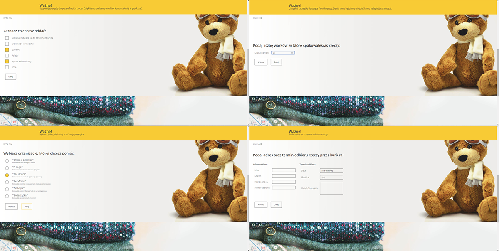

# Charity App
> Simple Spring MVC Web application which allows one to give away unwanted items to the charity institutions. 

## Table of contents
* [General info](#general-info)
* [Screenshots](#screenshots)
* [Technologies](#technologies)
* [Features](#features)
* [Status](#status)

## General info
This is a project created to summarize knowledge gained from CodersLab course.

## Screenshots
>landing page

>admin panel

>login page

>donation form

## Technologies
* Spring Boot - version 2.1.4 RELEASE
* Spring Security
* Spring Validation
* Spring Data
* Data Base - MySql - version 8.0.13
* ThymeLeaf - version 3.0.11. RELEASE

## Features
List of features and roles:
* anonymous user has access to:
  - landing page
  - registration page
  - list of organizations
  - login page
* user 
  - has access to: 
    - list of his/her donations
    - details of donation
    - account settings
  - can:
    - add donation
    - edit donation
    - archive donation
    - cancel/delete donation
    - edit settings
* admin
  - has access to everything above and:
    - details of organization
    - list of users
  - can everything above and:
    - activate / deactivate user's account
    - delete user's account
    - add / edit / delete organization
* super-admin
  - has access to everything above and:
    - list of admins
  - can everything above and:
    - activate / deactivate admins
    - grant / revoke permissions
    
Other features

* sending email with activation link
* reset password 

## Status
Project is: finished